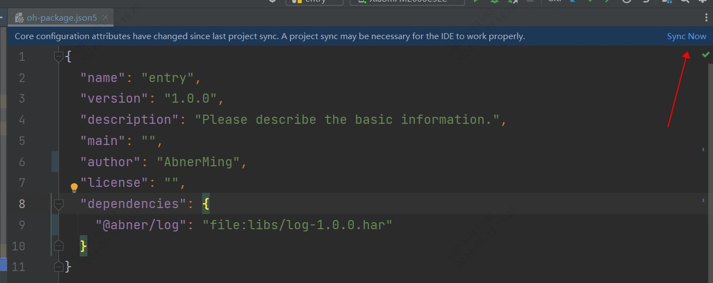
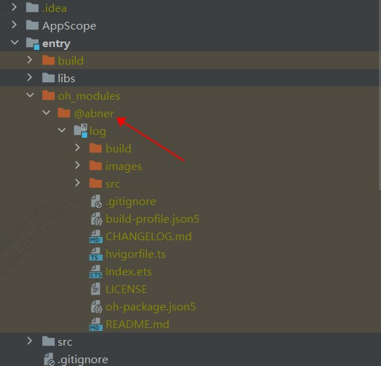

# HarmonyOsLog

HarmonyOsLog是一个日志打印工具，支持hilog和console两种工具打印，支持各种类型包含JSON格式化打印，非常的方便！

<p align="center">

</p>
<p align="center">

</p>

## 开发环境

DevEco Studio 4.0 Beta2,Build Version: 4.0.0.400

Api版本：9

hvigorVersion：3.0.2

## 快速使用

目前有多种使用方式，比如远程依赖、本地静态共享包依赖,源码方式依赖，推荐使用**远程依赖**，方便快捷，有最新修改可以及时生效。

### 1、远程依赖方式使用【推荐】

方式一：在Terminal窗口中，执行如下命令安装三方包，DevEco Studio会自动在工程的oh-package.json5中自动添加三方包依赖。

```
ohpm install @abner/log
```

方式二：在工程的oh-package.json5中设置三方包依赖，配置示例如下：

```
"dependencies": { "@abner/log": "^1.0.2"}
```

<p align="center"></p>

### 2、本地静态共享包har包使用

<p>首先，下载har包，<a href="https://vipandroid-image.oss-cn-beijing.aliyuncs.com/harmony/log/log-1.0.2.har">点击下载</a></p>
<p>下载之后，把har包复制项目中，目录自己创建，如下，我创建了一个libs目录，复制进去</p>
<p></p>
<p>引入之后，进行同步项目，点击Sync Now即可，当然了你也可以，将鼠标放置在报错处会出现提示，在提示框中点击Run 'ohpm install'。</p>
<p>需要注意，<strong>@abner/log</strong>，是用来区分目录的，可以自己定义，比如@aa/bb等，关于静态共享包的创建和使用，请查看如下我的介绍，这里就不过多介绍</p>

[HarmonyOS开发：走进静态共享包的依赖与使用](https://juejin.cn/post/7274982412245876776)

### 3、查看是否引用成功

无论使用哪种方式进行依赖，最终都会在使用的模块中，生成一个oh_modules文件，并创建源代码文件，有则成功，无则失败，如下：

<p align="center"></p>

## 全局初始化

初始化仅需要初始化一次即可，可以在AbilityStage进行，目前初始化中均有默认值，如果您使用默认值，就无需进行初始化。初始化采用的是对象参数传递形式，其参数您可以按实际需要进行传递，如果想和默认值保持一致，有些参数就可以省略。

```typescript
Log.init({
  tag: "HarmonyOSLog",
  domain: 0x0000,
  close: false,
  isHilog: true,
  showLogLocation: true,
  logSize: 800
})
```

### 初始化参数介绍

| 属性               | 类型      | 概述                                  |
|------------------|---------|-------------------------------------|
| tag              | string  | 打印的标签，默认为： HarmonyOSLog             |
| domain           | number  | 输出日志所对应的业务领域,默认为0x0000              |
| close            | boolean | 是否关闭打印，默认true为打开，false为不打印          |
| isHilog          | boolean | 打印类型，默认为true是hilog打印 ，false为console |
| mShowLogLocation | boolean | 是否展示点击的位置，默认为true是展示 ，false为不展示     |
| logSize          | number  | 日志每次输出大小，最大1024字节                   |

## 日志打印

### 统一标签打印

使用统一标签进行打印，直接传递打印内容即可。

```typescript
Log.info("我是一个info类型日志")
Log.debug("我是一个debug类型日志")
Log.warn("我是一个warn类型日志")
Log.error("我是一个error类型日志")
Log.fatal("我是一个fatal类型日志")
```

### 自定义标签

使用自定义标签进行打印

```typescript
Log.info("我是一个info类型日志", "testTag")
Log.debug("我是一个debug类型日志", "testTag")
Log.warn("我是一个warn类型日志", "testTag")
Log.error("我是一个error类型日志", "testTag")
Log.fatal("我是一个fatal类型日志", "testTag")
```

### json打印

json打印会进行格式化处理，直接传递json对象或者json字符串即可。

```typescript
Log.info({ "name": "AbnerMing", "age": 18 })
```

## 常见问题

如果你打算下载源码使用，并且你的开发环境比较低，会造成，运行工程失败问题，常见错误如下，是因为开发环境不一致造成。

<p align="center"></p>

**您可以选择解决问题，解决方式如下：**

[解决DevEco Studio低版本导入高版本项目运行失败问题](https://juejin.cn/post/7280746811328692258)

您也可以不运行，直接进行使用，完全没有问题。

## 欢迎关注作者

微信搜索【App开发干货铺】，或扫描下面二维码关注，查阅更多技术文章！


## 赞赏作者

看在作者这么努力的份上，微信赞赏随意，给个鼓励好不好~


## License

```
Copyright (C) AbnerMing, HarmonyOsLog Open Source Project

Licensed under the Apache License, Version 2.0 (the "License");
you may not use this file except in compliance with the License.
You may obtain a copy of the License at

     http://www.apache.org/licenses/LICENSE-2.0

Unless required by applicable law or agreed to in writing, software
distributed under the License is distributed on an "AS IS" BASIS,
WITHOUT WARRANTIES OR CONDITIONS OF ANY KIND, either express or implied.
See the License for the specific language governing permissions and
limitations under the License.
```


